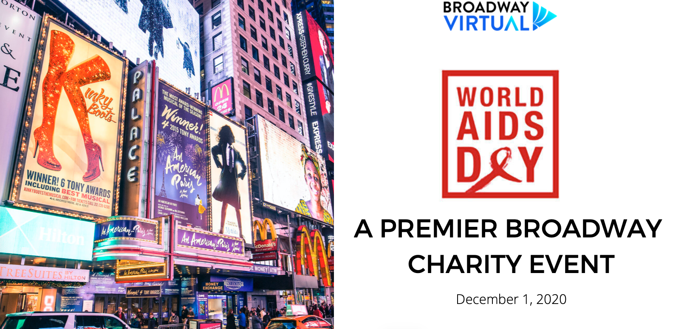
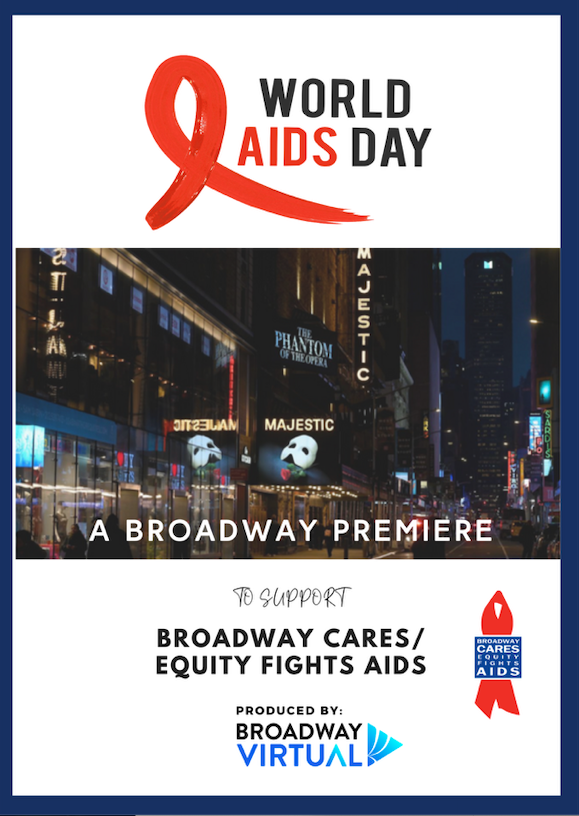
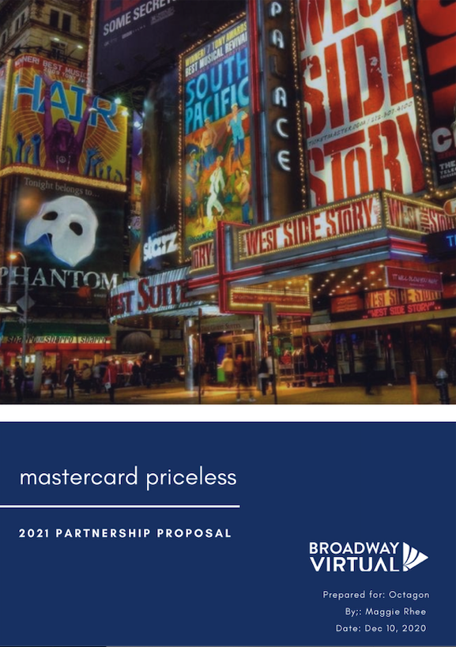

# Broadway Virtual

**Sponsorship Marketing | Event Promotion | Partnership Strategy | Presentation Development**

## Overview

Broadway Virtual is a film and theatre production company focused on expanding theatrical experiences through modern technology and digital distribution.

## My Work

- Sponsorship marketing and positioning
- Partnership strategy
- Event marketing and promotion
- Audience profiling
- Sponsorship opportunity development
- Presentation development
- Promotional and branded communications

## Selected Marketing & Sponsorship Work

### Broadway Virtual — Marketing & Sponsorship Strategy

Developed marketing and sponsorship materials supporting Broadway Virtual's positioning, partnership strategy, promotional initiatives, and business development efforts.

  

[View Full Broadway Virtual Presentation](Elegies - Broadway Virtual  12120.pdf)

### World AIDS Day — Event & Sponsorship Marketing

Developed event marketing and sponsorship materials for Broadway Virtual's World AIDS Day charity production of *Elegies for Angels, Punks and Raging Queens*.

The campaign materials communicated the event opportunity, promotional strategy, audience profile, sponsorship opportunities, and benefits available to prospective partners.

  

[View Full World AIDS Day Presentation](World-AIDS-Day-Presentation.pdf)

### Mastercard Sponsorship Proposal

Developed branded sponsorship materials presenting partnership opportunities and promotional value for a prospective corporate sponsor.

  

---

[← Back to Marketing & Communications Portfolio](../README.md)
