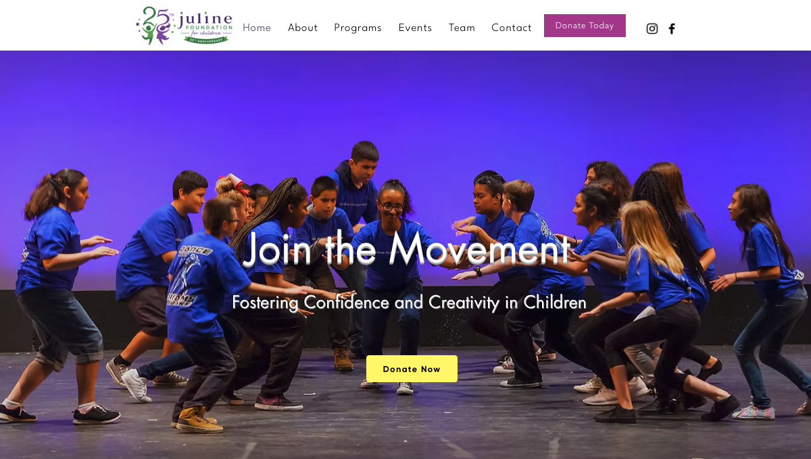
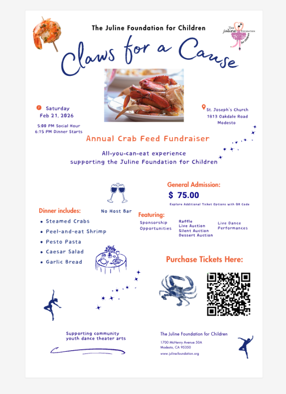
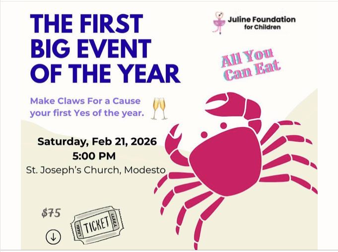
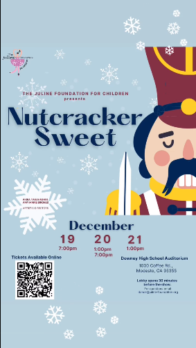

# Juline Foundation

**Website Design | Nonprofit Communications | Event Marketing**

## Overview

The Juline Foundation for Children is a nonprofit organization focused on providing arts and dance education opportunities that foster confidence, creativity, and personal growth in children.

## My Work

- Website design and content development
- Nonprofit messaging and communications
- Program and mission-focused content
- Event marketing and promotion
- Promotional material development

## Website Design

Designed the Juline Foundation website to communicate the organization's mission, programs, and impact while creating a welcoming digital presence for families, supporters, and the community.

[Visit the Juline Foundation Website](https://www.juline-foundation.org/)

## Event Marketing & Social Promotion

Developed event marketing and promotional materials supporting Juline Foundation fundraising and performing arts initiatives across digital and social channels.

### Claws for a Cause — Annual Crab Feed Fundraiser

Developed campaign creative and promotional materials for the foundation's annual fundraising event, including event information, ticketing calls to action, fundraising activities, and social promotion.

**Social & Promotional Creative**

### Nutcracker Sweet 2025

Developed promotional creative supporting the Juline Foundation's annual Nutcracker Sweet performance, including event awareness, ticketing, and social promotion.

---

[← Back to Marketing & Communications Portfolio](../README.md)
