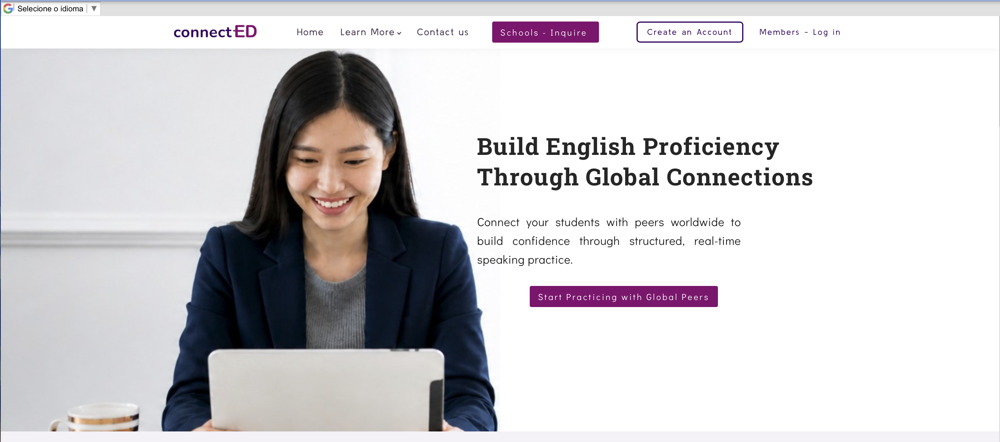
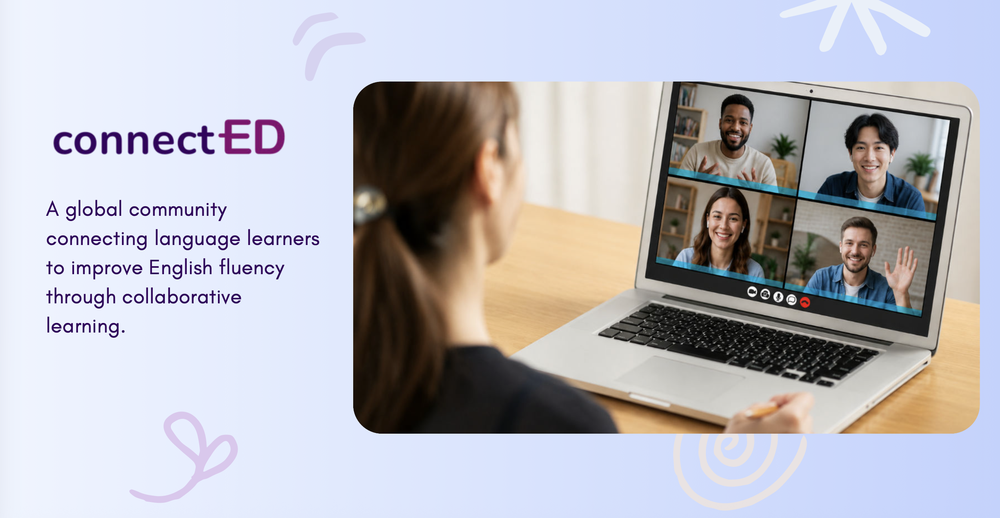

# connect-ED

**Brand Strategy | Website Design | Marketing Communications | Product Positioning**

## Overview

connect-ED is a global English-language learning platform designed to help learners improve speaking fluency through collaborative learning and real-world conversation.

## My Work

- Brand positioning and messaging
- Website design and content development
- Marketing and product strategy
- Presentation development
- Audience and market positioning
- Marketing channel strategy

## Website Design

Designed the connect-ED website to communicate the platform's value proposition, learning approach, and emphasis on building English fluency through global connections.

[Visit the connect-ED Website](https://www.connect-ed.app/)

## Marketing & Product Strategy

Developed marketing and presentation materials communicating the market opportunity, learner problem, product solution, target audiences, marketing channels, and business strategy.

[View Full Presentation](Final%20GSV-compressed.pdf)

## Targeted & International Marketing Communications

Developed audience-specific and multilingual marketing collateral to support connect-ED's outreach to international universities and specialized student communities. Materials were adapted for specific academic audiences and global markets while maintaining consistent brand positioning and visual identity.

### Global Film Student Network

Created targeted outreach materials for film students focused on building English fluency through industry-specific conversations and international peer connections.

**Materials:**  
[English](Global%20Film%20Network.pdf) | [Spanish](Red%20Global%20de%20Estudiantes%20de%20Cine.pdf) | [Portuguese](Rede%20Global%20de%20Estudantes%20de%20Cinema%20.pdf) | [Korean](글로벌%20영화%20학생%20네트워크.pdf) | [Chinese](全球电影学生交流网络.pdf)

### Global Media Student Network

Developed specialized marketing collateral for university students in communications, journalism, public relations, advertising, marketing, digital media, and broadcasting.

**Materials:**  
[English](Global%20Media%20Network.pdf) | [Korean](Global%20Media%20Network-%20KR.pdf)

**Available in:** English | Korean
---

[← Back to Marketing & Communications Portfolio](../README.md)

